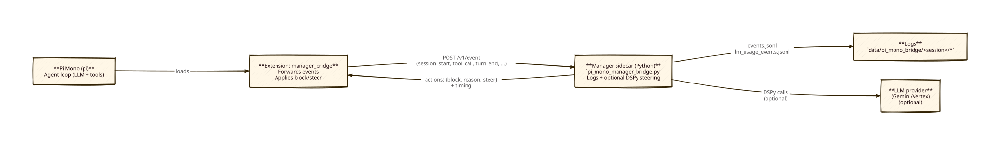
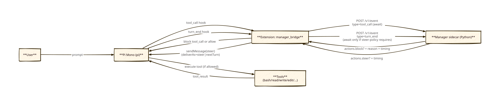

# Pi Mono Manager-Bridge Runbook (Variant B: Manager Outside Pi)

This runbook lets you run Pi Mono as the **agent loop** while this repo provides an external **Manager sidecar** (supervision/tracing + optional steering) via a Pi extension.

## Diagrams

## What you’re running

- **Pi Mono (`pi`)**: runs the LLM/tool loop.
- **Pi extension**: `integrations/pi_mono/extensions/manager_bridge/index.ts`
  - forwards lifecycle events to the Manager sidecar
  - can block tool calls (`tool_call`) and inject steering (`turn_end`)
- **Manager sidecar (Python)**: `scripts/pi_mono_manager_bridge_server.py` + `pi_mono_manager_bridge.py`
  - logs events to `data/pi_mono_bridge/<session>/events.jsonl`
  - optionally calls DSPy on `turn_end` and logs timings to `data/pi_mono_bridge/<session>/lm_usage_events.jsonl`

## Prerequisites

- **Pi Mono CLI** available as `pi`
  - If you’re using the local checkout: `../../dev-external/pi-mono/` (see `../../dev-external/pi-mono/packages/coding-agent/README.md` for setup/build details).
  - If `pi` is not on your PATH, one workable local build path is:
    - `cd ../../dev-external/pi-mono`
    - `npm install`
    - `npm run build -w @mariozechner/pi-coding-agent`
    - run via `node packages/coding-agent/dist/cli.js ...` (or symlink/alias to `pi`)
- Python env for this repo (recommended): `uv run ...` (fallback: `.venv/bin/python ...` if `uv` is broken locally).

## Step-by-step: quick end-to-end (trace-only, fastest)

### Step 1: (Optional) run unit tests

- Python: `uv run python test_pi_mono_manager_bridge.py`
- Extension (bundles with pi-mono’s esbuild): `node scripts/test_pi_mono_manager_bridge_extension.mjs`

### Step 2: start the Manager sidecar (HTTP)

In repo root:

`uv run python scripts/pi_mono_manager_bridge_server.py --port 8787`

Quick health check:

`curl -s http://127.0.0.1:8787/healthz`

### Step 3: run Pi with the extension

In another terminal (repo root), load the extension and point it at the sidecar:

`pi -e integrations/pi_mono/extensions/manager_bridge/index.ts --manager-url http://127.0.0.1:8787`

Notes:
- Default forwarded events are minimal: `session_start,before_agent_start,tool_call,turn_end`
- Default steering policy is conservative: `--manager-steer-policy on_error`

### Step 4: trigger a tool call + confirm bridging works

In Pi, ask for a trivial bash command (example prompt):

“Run `echo hi` via the bash tool.”

Expected:
- Pi UI status shows `manager: ok (...)` with RTT (and `server ...ms` if provided).
- A new session dir appears under `data/pi_mono_bridge/` with `events.jsonl`.

## Step-by-step: safe blocking test

The current bridge blocks any bash command *containing* `rm -rf` (string match). To test blocking without risk, use a command that only **prints** that substring:

Prompt in Pi:

“Run `echo \"rm -rf\"` via the bash tool.”

Expected:
- The tool call is blocked (no command runs).
- The manager response includes `actions.block=true` and a `reason`.

## Optional: Unix socket mode (no TCP ports)

Start sidecar:

`uv run python scripts/pi_mono_manager_bridge_server.py --unix-socket /tmp/dca_manager_bridge.sock`

Run Pi:

`pi -e integrations/pi_mono/extensions/manager_bridge/index.ts --manager-url unix:/tmp/dca_manager_bridge.sock`

## Optional: enable DSPy steering + LM timings

Start sidecar with LM enabled:

`uv run python scripts/pi_mono_manager_bridge_server.py --enable-lm --steer-policy on_error`

Run Pi and ensure it awaits steering:

`pi -e integrations/pi_mono/extensions/manager_bridge/index.ts --manager-url http://127.0.0.1:8787 --manager-steer-policy always`

Verify after a run:

- `data/pi_mono_bridge/<session>/lm_usage_events.jsonl` contains entries with `timing.started_at`, `timing.ended_at`, `timing.duration_ms`.

## Regenerating the SVG diagrams

- `d2to.sh docs/external/PI_MONO_MANAGER_BRIDGE_RUNBOOK_arch.d2`
- `d2to.sh docs/external/PI_MONO_MANAGER_BRIDGE_RUNBOOK_flow.d2`
