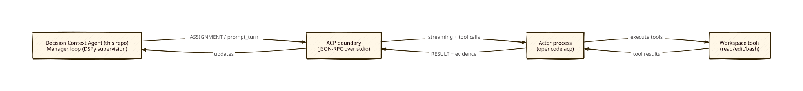
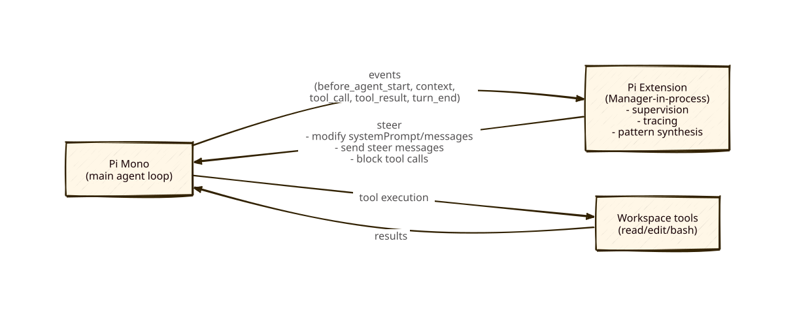
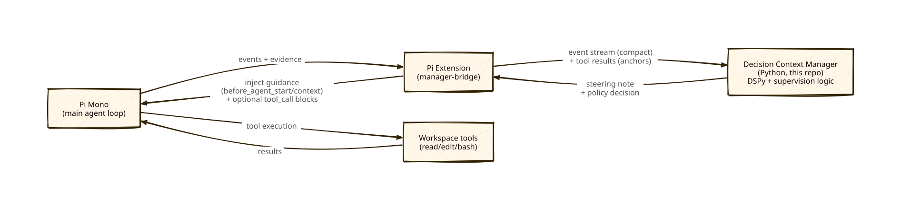

# Pi Mono as Vehicle: Hooking Decision Context “Manager” Logic Into Pi

## Closest-to-today (very short)

The closest analog to our current repo (/Users/cgint/dev/decision-context-agent) architecture would be: **Pi Mono runs the agent loop**, while a **Pi Extension** hosts (or calls out to) our Manager logic to produce **steering notes + safety/policy decisions**, and injects those into Pi’s next LLM call via `before_agent_start` / `context` hooks.

This is the inverse of what we do today (Manager drives the loop and delegates to an Actor via ACP).

---

## Why diagrams help here

This choice is mostly about **where the control loop lives** (outside the agent vs inside the agent runtime). A diagram makes the control points, feedback paths, and “who owns tools” immediately obvious.

The diagrams below are rendered as SVGs (with `.d2` sources checked in next to them).

---

## Current architecture (Manager-driven, ACP to Actor)

Source: [PI_MONO_MANAGER_HOOKIN_current.d2](PI_MONO_MANAGER_HOOKIN_current.d2)

Notes:

- The Manager owns the “step loop” and decides when to delegate.
- The Actor owns tool usage decisions inside its turn, but the boundary is clean and replayable.

---

## Proposed inversion (Pi-driven agent loop + Manager hook-in)

### Variant A: Manager logic lives *inside* Pi (as an Extension)

Source: [PI_MONO_MANAGER_HOOKIN_inversion_a.d2](PI_MONO_MANAGER_HOOKIN_inversion_a.d2)

### Variant B: Manager logic lives *outside* Pi (Extension ↔ Manager sidecar)

Source: [PI_MONO_MANAGER_HOOKIN_inversion_b.d2](PI_MONO_MANAGER_HOOKIN_inversion_b.d2)

Key inversion differences vs today:

- **Pi owns the loop.** The “Manager” becomes a *policy/steering layer* inside (or adjacent to) Pi.
- **Tools are executed by Pi**, not by a separate Actor behind ACP (unless you still choose RPC/SDK/ACP under Pi).

---

## What Pi Mono exposes that makes “Manager hook-in” feasible

Pi Mono’s Extension API provides multiple hook points that are directly relevant to supervision + tracing:

- **Steering the next model call**
  - `before_agent_start`: can replace/chain `systemPrompt` for the upcoming loop.
  - `context`: fires **before each LLM call** and can **modify the message list** (i.e., inject “steering notes” exactly where they matter).
- **Tool supervision**
  - `tool_call`: can **block** a tool call (but does not rewrite tool inputs).
  - `tool_result`: can **modify/redact** what the model sees as tool output (useful for safety + context hygiene).
- **Loop awareness**
  - `turn_end`: provides the assistant message + tool results for that turn (good “supervision tick” boundary).
- **Out-of-band steering**
  - Extensions can `sendUserMessage(..., deliverAs: "steer")` to steer while streaming, or queue guidance for the next turn.
- **State persistence**
  - Extensions can `appendEntry(...)` for durable state that is **not sent to the LLM** (store your Manager state there, then inject a small derived summary into the prompt when needed).

Evidence pointers (pi-mono repo):

- `packages/coding-agent/README.md` → “Skills” vs “Extensions”, and “Event Interception”.
- `packages/coding-agent/src/core/extensions/types.ts` → event list + the ability to modify `systemPrompt` / `messages` / send steer messages / persist state.

---

## Integration options (and how close they are to “opposite”)

### Option 1 — “Full inversion”: Manager inside Pi (TypeScript Extension)

**How:** Port (or rewrite) Manager logic into a Pi Extension. Use Extension hooks to:

- compute supervision/traces on `turn_end` / `tool_result`,
- inject guidance via `before_agent_start` / `context`,
- block only minimal hard-safety violations via `tool_call`,
- persist Manager state via `appendEntry`.

**Pros**

- One runtime owns the loop; no ACP overhead.
- Tightest possible hook surface (pre-LLM-call `context` hook).

**Cons / risks**

- Porting effort is likely large (DSPy modules + data model + logging conventions).
- High risk of recreating “micromanagement”, just *inside* the agent runtime.
- Any bug in the Extension can destabilize the primary agent loop.

**When it’s worth it:** if you want Pi to be the product “vehicle” and you’re willing to invest in a single integrated runtime.

---

### Option 2 — “Pragmatic inversion”: Pi Extension + Manager sidecar (Python, this repo)

**How:** Keep Manager code in this repo. Add a thin Pi Extension that:

- streams events/tool evidence to the Manager sidecar,
- receives back a compact “steering note” + optional “blocklist” decision,
- injects that note into `before_agent_start` / `context`.

**Implementation note:** A concrete Variant B “manager-bridge” (extension + sidecar server) lives in `docs/external/PI_MONO_MANAGER_BRIDGE_VARIANT_B.md`.

**Pros**

- Minimal rewrite; reuses our DSPy + trace/pattern synthesis code.
- You can dial how often the Manager runs (only on `turn_end`, or only on suspicious patterns).

**Cons / risks**

- IPC overhead + reliability concerns (Extension must handle timeouts/failed Manager calls).
- You now have *two* runtimes to deploy and observe.

**When it’s worth it:** if you want Pi’s loop + hook points *now*, without rewriting the Manager.

---

### Option 3 — “Not inverted, but closest to today”: Manager drives, Pi is the Actor via SDK/RPC

**How:** Run Pi in RPC mode or embed via SDK; keep our Manager step loop as the driver (similar to ACP → OpenCode).

**Pros**

- Closest mental model to today; clear boundary.
- Easy to reason about evaluation harness integration (SWE-bench).

**Cons**

- Does not leverage Pi’s in-loop steering hooks as deeply.
- Still has a process/protocol boundary (though not necessarily ACP).

---

## Feasibility verdict (for “Pi drives + Manager steers”)

- **Observability:** High (tool + turn lifecycle events are first-class).
- **Steerability:** High (prompt/message modification hooks + steer message queue).
- **Tool-level control:** Medium (block/allow is easy; rewriting tool args is not supported directly).
- **Manager complexity fit:** Best with “orchestrator-style” supervision (loop detection, high-level guidance) rather than per-tool micromanagement.

---

## Practical PoC proposal (small, testable, low-regret)

1. Build a Pi Extension that logs: `before_agent_start`, `context`, `tool_call`, `tool_result`, `turn_end`.
2. Add a “Manager bridge” call (HTTP/stdin) that sends a compact event bundle to our Python Manager.
3. Manager returns a single **Steering Note** (<= N lines) + optional **Block Rules** (very small).
4. Extension injects the Steering Note into `systemPrompt` (or `context.messages`) and only blocks obvious hazards.
5. Measure: end-to-end latency per turn, number of tool calls, and time spent waiting for the Manager vs the model.

---

## Open questions (things to decide early)

- What is the **supervision tick**? (`turn_end` only vs every `tool_result` vs heuristic-triggered)
- What is the **steering output format**? (single note vs structured sections like `STATE_DELTA`, `ACTIVE_RULES`, `OPEN_QUESTIONS`)
- How do we prevent **context bloat** when injecting guidance repeatedly?
- If SWE-bench remains a core target: how do we package Pi + Extension + Manager sidecar per workspace instance?

---

## Related docs (this repo)

- `edit_comparison.md` (high-level comparison + hook points summary)
- `docs/information/MANAGER_ACTOR_INTERFACE.md` (the task-level delegation contract we use today)
- `docs/external/OPENCODE_ACP_FINDINGS.md` (ACP/OpenCode boundary details)
